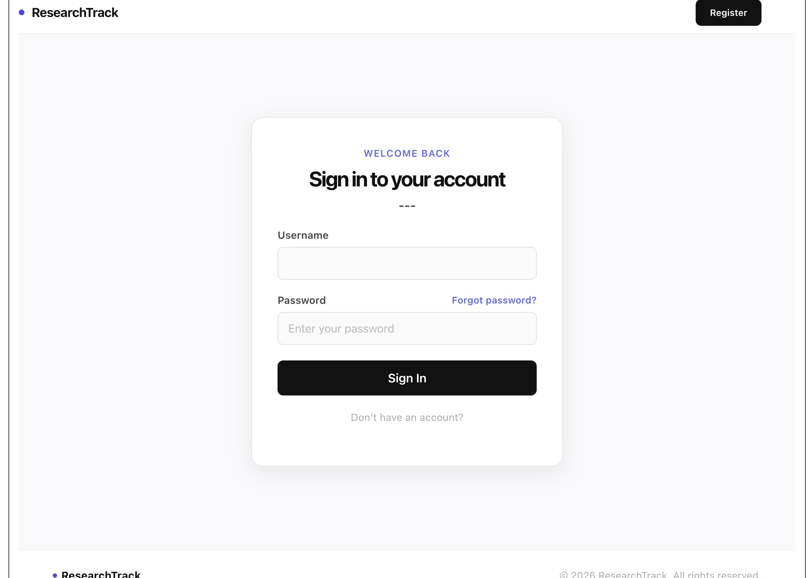
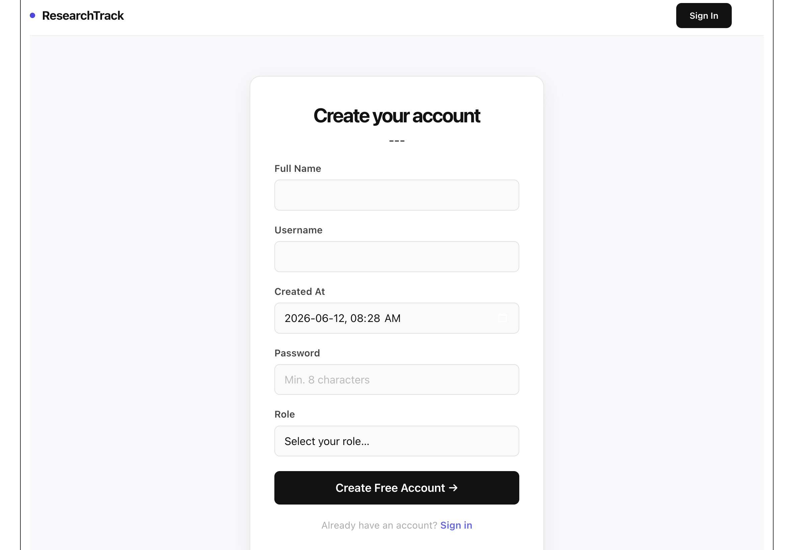
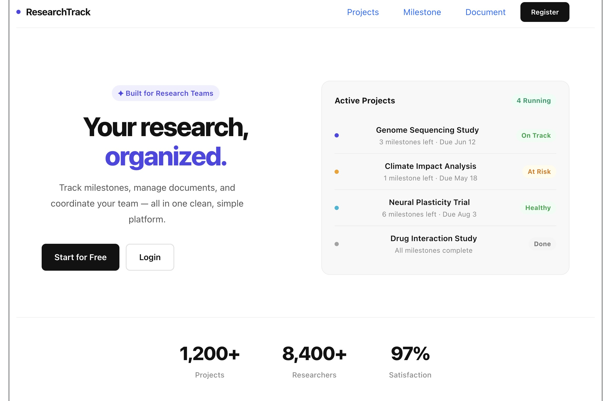
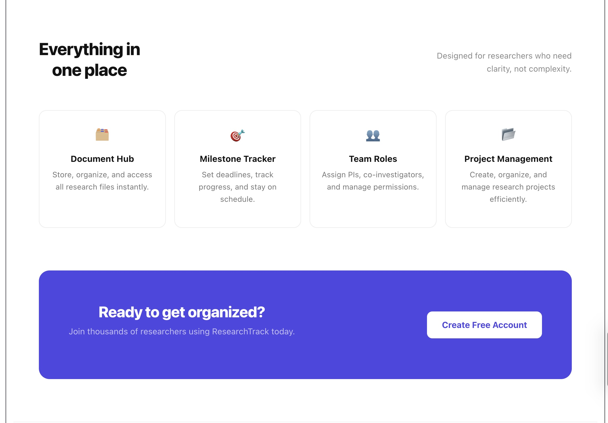
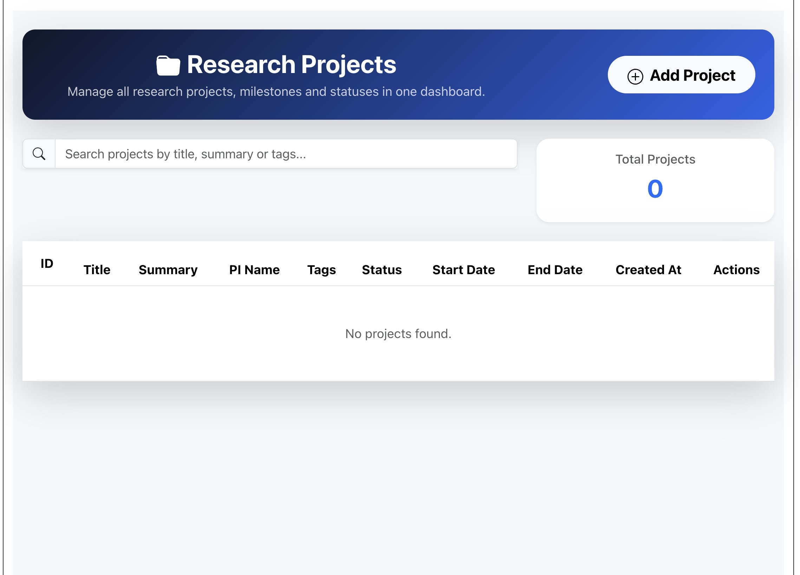
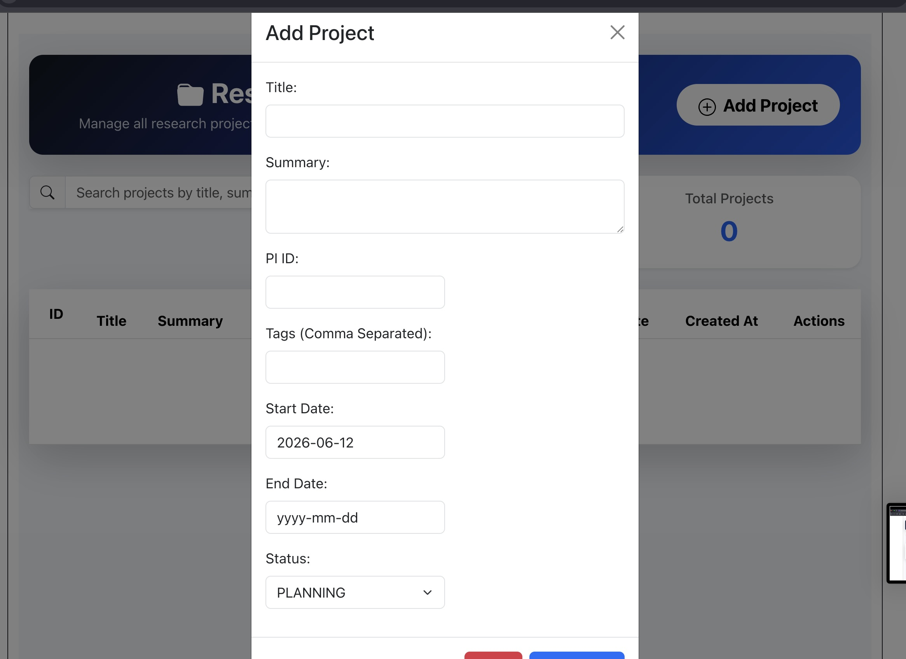
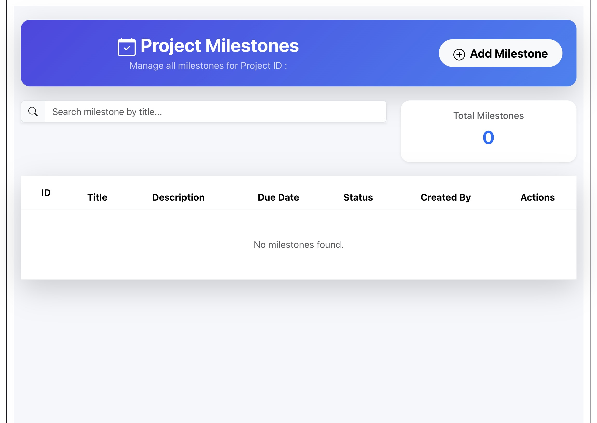
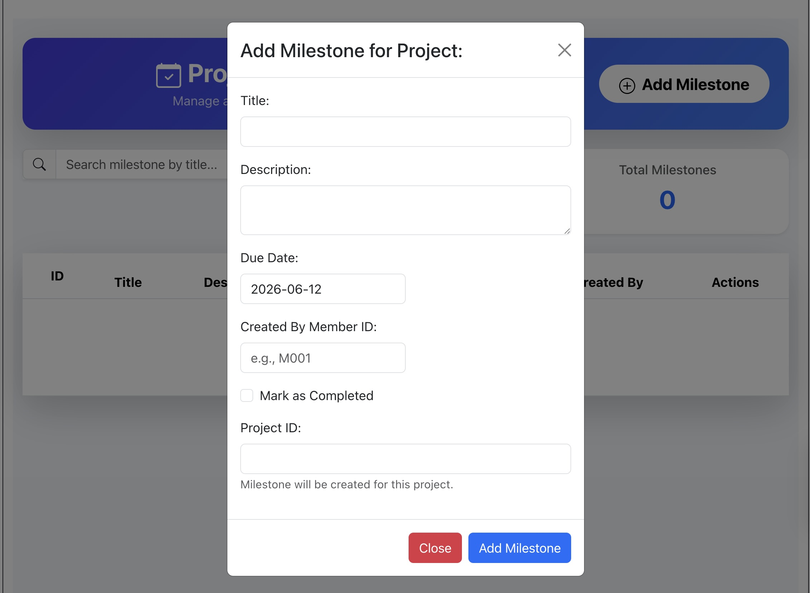
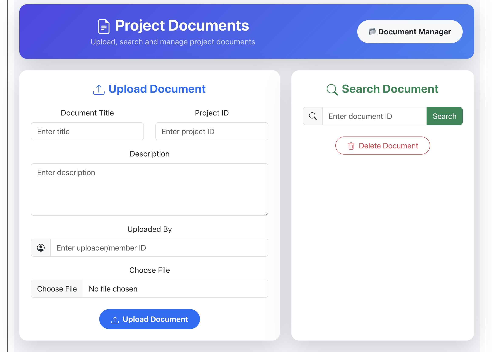

#  Research Project Tracker System

A secure and scalable Research Project Management System developed using Spring Boot, Spring Security, JWT Authentication, JPA, and MySQL. This application enables educational institutes to manage research projects, milestones, documents, and users with role-based access control.

##  Features

###  Authentication & Authorization

* User Registration (Sign Up)
* User Login (JWT Authentication)
* Secure Password Encryption using BCrypt
* Role-Based Access Control (ADMIN, PI, MEMBER, VIEWER)

###  Project Management

* Create Research Projects
* Update Project Details
* Manage Project Status
* View Project Information
* Delete Projects (Admin Only)

###  Milestone Management

* Add Project Milestones
* Update Milestones
* Track Completion Status
* Delete Milestones

###  Document Management

* Upload Research Documents
* View Uploaded Documents
* Manage Project Resources
* Delete Documents

###  User Management

* User Registration & Authentication
* User Profile Management
* User Role Management
* Admin User Controls

###  Security Features

* JWT Token Authentication
* Spring Security Integration
* Stateless Authentication
* Protected REST APIs
* Custom Exception Handling

---

##  Technology Stack

| Technology      | Description                       |
| --------------- | --------------------------------- |
| Spring Boot     | Backend Framework                 |
| Spring Security | Authentication & Authorization    |
| JWT             | Secure Token-Based Authentication |
| Spring Data JPA | Database Access Layer             |
| MySQL           | Database                          |
| Maven           | Dependency Management             |
| Lombok          | Boilerplate Code Reduction        |
| Git & GitHub    | Version Control                   |

---

##  Application Screenshots

###  Login Page



---

###  Register Page



---

###  Home Dashboard




---

###  Project Management Page




---

###  Milestone Management Page
 


---

###  Documents Management Page



---

##  Project Structure

```text
src/main/java
│
├── auth
├── config
├── user
├── project
├── milestone
├── document
└── common
```

---

##  API Endpoints

### Authentication

| Method | Endpoint           | Description   |
| ------ | ------------------ | ------------- |
| POST   | /api/auth/register | Register User |
| POST   | /api/auth/login    | Login User    |

### Projects

| Method | Endpoint                  |
| ------ | ------------------------- |
| GET    | /api/projects             |
| GET    | /api/projects/{id}        |
| POST   | /api/projects             |
| PUT    | /api/projects/{id}        |
| PATCH  | /api/projects/{id}/status |
| DELETE | /api/projects/{id}        |

### Milestones

| Method | Endpoint                      |
| ------ | ----------------------------- |
| GET    | /api/projects/{id}/milestones |
| POST   | /api/projects/{id}/milestones |
| PUT    | /api/milestones/{id}          |
| DELETE | /api/milestones/{id}          |

### Documents

| Method | Endpoint                     |
| ------ | ---------------------------- |
| GET    | /api/projects/{id}/documents |
| POST   | /api/projects/{id}/documents |
| DELETE | /api/documents/{id}          |

---

##  Database

Database: **MySQL**

Main Entities:

* User
* Project
* Milestone
* Document

Relationships:

* One User → Many Projects
* One Project → Many Milestones
* One Project → Many Documents

---

##  Installation

### Clone Repository

```bash
git clone https://github.com/SanjanaAbeysinghe/Research-Project-Tracker-Backend.git
```

### Navigate to Project

```bash
cd Research-Project-Tracker-Backend
```

### Configure Database

Update `application.properties`

```properties
spring.datasource.url=jdbc:mysql://localhost:/research_tracker
spring.datasource.username=root
spring.datasource.password=
```

### Run Application

```bash
mvn spring-boot:run
```

---

##  Author

**Sanjana Deshan**

GitHub: https://github.com/SanjanaAbeysinghe

---

##  Future Improvements

* File Storage Integration
* Email Notifications
* Research Team Collaboration
* Advanced Search & Filtering
* Dashboard Analytics

---

##  License

This project is developed for educational purposes under the CMJD Coursework.
